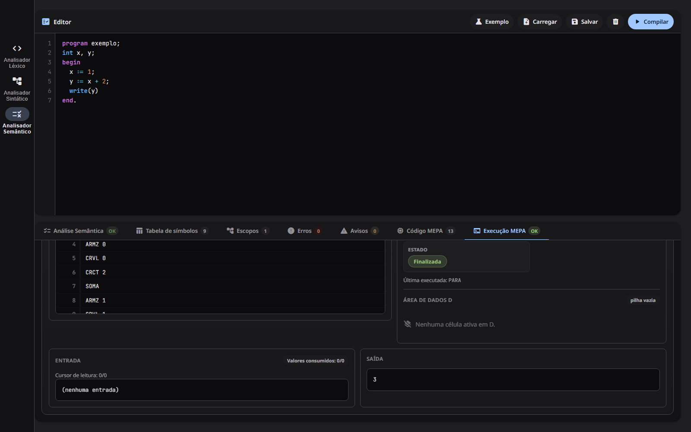
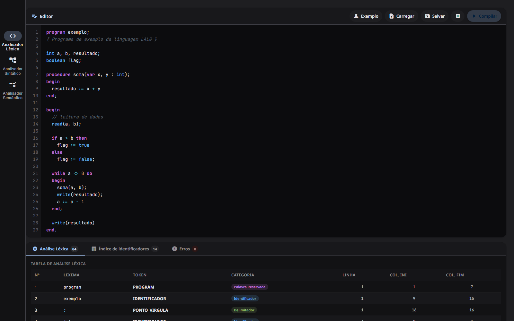
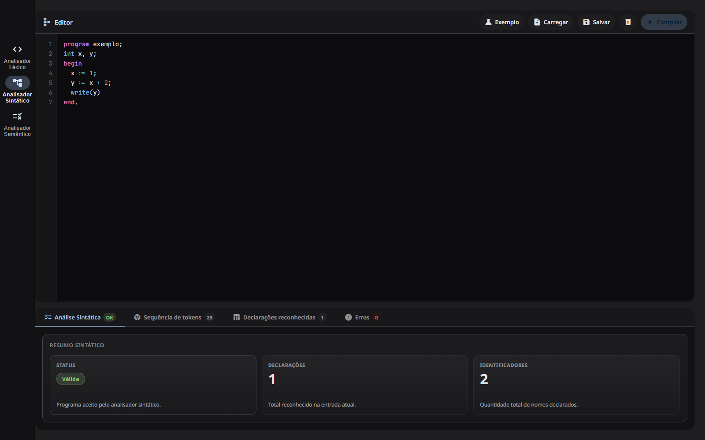
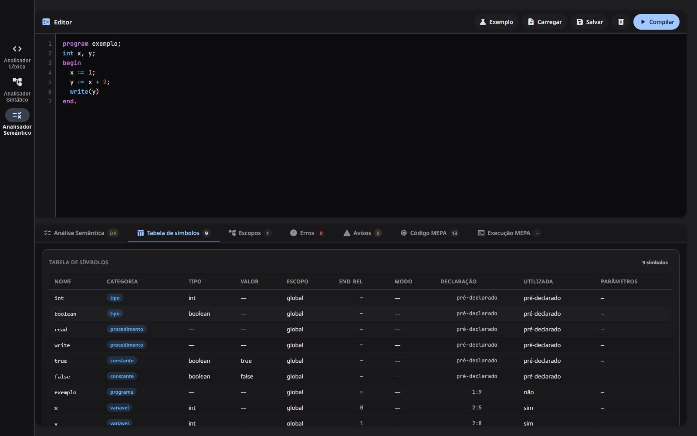
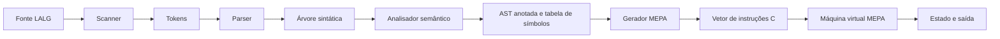

# Compilador didático LALG

Aplicação web educacional que percorre as principais etapas de um compilador para um subconjunto da linguagem LALG: análise léxica, análise sintática, análise semântica, geração de código MEPA e execução em uma máquina virtual didática.

O projeto principal está em [`LALG/`](./LALG) e foi construído somente com HTML, CSS e JavaScript. Não há instalação de pacotes, transpilação ou etapa de build.

## Sumário

- [Funcionalidades](#funcionalidades)
- [Demonstração](#demonstração)
- [Pipeline do compilador](#pipeline-do-compilador)
- [Como executar](#como-executar)
- [Como usar](#como-usar)
- [Exemplo completo](#exemplo-completo)
- [Subconjunto LALG implementado](#subconjunto-lalg-implementado)
- [Arquitetura](#arquitetura)
- [Limitações atuais](#limitações-atuais)
- [Desenvolvimento](#desenvolvimento)



## Funcionalidades

- Editor com numeração de linhas, realce de sintaxe e marcação visual de erros.
- Importação de arquivos `.txt` e `.lalg` e download do código-fonte editado.
- Exemplo pronto em cada analisador para testar a aplicação rapidamente.
- Tabela léxica com lexema, token, categoria e posição no código-fonte.
- Índice de identificadores e suas ocorrências.
- Parser descendente recursivo com recuperação de erros e resumo das declarações de variáveis reconhecidas.
- Tabela de símbolos, escopos, validação de tipos, erros e avisos semânticos.
- Geração de instruções MEPA com relação entre o fonte LALG e o código produzido.
- Máquina virtual MEPA com execução completa ou passo a passo, memória, contador de programa, topo da pilha, entrada e saída.
- Diagnósticos léxicos, sintáticos e semânticos com linha e coluna; um clique no erro seleciona o trecho correspondente no editor.
- Interface responsiva para diferentes tamanhos de tela.

## Demonstração

### Análise léxica

O scanner reconhece os tokens e informa a posição de cada lexema. A interface usa esses tokens para construir um índice das ocorrências de identificadores.



### Análise sintática

O parser verifica a estrutura do programa e apresenta a sequência léxica, as declarações de variáveis reconhecidas e os diagnósticos sintáticos.



### Análise semântica

A etapa semântica resolve nomes, organiza escopos, atribui tipos e produz a tabela de símbolos usada na geração de código.



### Execução MEPA

Depois de gerar o código intermediário, a aplicação permite inspecionar e executar cada instrução na máquina virtual. A primeira imagem desta página mostra uma execução finalizada com saída `3`.

## Pipeline do compilador



Os erros de uma fase bloqueiam as etapas que dependem dela:

1. `scanner()` transforma o texto em tokens e registra erros léxicos.
2. `analisarPrograma()` só executa o parser quando não há erros léxicos e então produz a árvore sintática.
3. `analisarSemantica()` valida declarações, escopos, categorias e tipos.
4. `gerarMepa()` converte um programa semanticamente válido e pertencente ao subconjunto suportado pelo gerador em instruções estruturadas.
5. `MepaInterpreter` executa essas instruções e expõe o estado da máquina virtual.

As instruções podem preservar a posição e o construto de origem, o que permite relacionar o código-fonte LALG com o MEPA e enriquecer os erros de execução.

## Como executar

### Pré-requisitos

- Um navegador moderno, como Chrome, Edge ou Firefox.
- Python 3 é opcional, mas recomendado para iniciar um servidor HTTP local.
- Node.js é opcional e necessário somente para a checagem de sintaxe descrita em **Desenvolvimento**.
- Acesso à internet é usado apenas para carregar fontes e ícones do Google Fonts. O compilador permanece local, embora a aparência possa mudar sem essa conexão.

Clone o repositório:

```bash
git clone https://github.com/almeidaAugusto/compiladores_projeto.git
cd compiladores_projeto
```

Inicie um servidor local na raiz do repositório:

```bash
python -m http.server 8000
```

No Windows, se o comando anterior não estiver disponível, use:

```powershell
py -m http.server 8000
```

Acesse [http://localhost:8000/LALG/](http://localhost:8000/LALG/) e encerre o servidor com `Ctrl+C`.

> Como os arquivos usam apenas caminhos relativos, também é possível abrir `LALG/index.html` diretamente. O servidor local é recomendado por oferecer um comportamento mais próximo de uma hospedagem web.

## Como usar

1. Escolha **Analisador Léxico**, **Analisador Sintático** ou **Analisador Semântico** na barra lateral.
2. Digite o programa no editor, use **Exemplo** ou carregue um arquivo `.txt`/`.lalg`.
3. Pressione **Compilar** e navegue pelas guias de resultados.
4. Na etapa semântica, um programa válido e suportado pelo gerador preenche **Código MEPA** e habilita **Execução MEPA**.
5. Se o programa usar `read`, informe os valores separados por espaços, vírgulas ou linhas.
6. Use **Executar** para concluir o programa, **Próximo passo** para avançar uma instrução ou **Reiniciar** para restaurar a máquina.

Cada analisador possui seu próprio editor. O conteúdo não é copiado automaticamente entre as três telas.

## Exemplo completo

O programa abaixo lê dois inteiros, calcula `a + b * 2` e escreve o resultado:

```text
program soma;
int a, b, total;
begin
  read(a, b);
  total := a + b * 2;
  write(total)
end.
```

Use `3 4` como entrada da execução MEPA. A saída esperada é:

```text
11
```

Observe que não há `;` depois de `write(total)`: na gramática implementada, o ponto e vírgula separa comandos e não os encerra.

Um teste mínimo também pode ser usado:

```text
program minimo;
begin
  write(42)
end.
```

Saída esperada: `42`.

## Subconjunto LALG implementado

### Estrutura de programa

Todo programa segue a forma geral:

```text
program nome;
  declarações
begin
  comandos
end.
```

Um bloco aceita primeiro as declarações de variáveis e depois as declarações de procedimentos, antes do `begin`. Blocos compostos precisam conter ao menos um comando.

### Tipos e declarações

Os tipos disponíveis são:

- `int`: números inteiros;
- `boolean`: valores `true` e `false`.

Exemplos:

```text
int contador, total;
boolean concluido;
```

`int`, `boolean`, `read`, `write`, `true` e `false` são identificadores predefinidos pela análise semântica. Palavras reservadas e identificadores não diferenciam maiúsculas de minúsculas.

O modificador `var` é aceito somente em parâmetros passados por referência:

```text
procedure incrementar(var valor : int);
begin
  valor := valor + 1
end;
```

### Comandos

- atribuição: `valor := expressao`;
- chamada de procedimento: `processar(valor)`;
- bloco composto: `begin ... end`;
- condição: `if <condição> then <comando> [else <comando>]`;
- repetição: `while <condição> do <comando>`;
- entrada predefinida: `read(a, b)`;
- saída predefinida: `write(resultado)`.

`read` exige uma ou mais variáveis atribuíveis do tipo `int`. `write` aceita uma ou mais expressões do tipo `int`.

### Expressões e operadores

| Categoria | Operadores | Tipos principais |
| --- | --- | --- |
| Aritméticos | `+`, `-`, `*`, `div` | `int` |
| Booleanos | `not`, `and`, `or` | `boolean` |
| Relacionais de ordem | `<`, `<=`, `>`, `>=` | operandos `int`; resultado `boolean` |
| Igualdade | `=`, `<>` | operandos do mesmo tipo; resultado `boolean` |

A precedência, da maior para a menor, é:

1. fatores, parênteses e `not`;
2. `*`, `div` e `and`;
3. sinal unário inicial `+` ou `-`;
4. `+`, `-` e `or`;
5. no máximo uma relação (`=`, `<>`, `<`, `<=`, `>` ou `>=`).

`:=` pertence ao comando de atribuição e exige tipos idênticos; ele não é um operador de expressão.

A divisão inteira usa `div`. Uma barra `/` isolada é um erro léxico.

Identificadores começam com uma letra ASCII ou `_` e podem continuar com letras ASCII, dígitos ou `_`. Letras acentuadas não são aceitas em identificadores.

### Comentários

```text
// comentário até o fim da linha

{ comentário
  em bloco }
```

Comentários em bloco não são aninhados.

### Regras importantes de pontuação

- `;` separa comandos: não o coloque imediatamente antes de `end` ou `else`.
- Procedimentos sem parâmetros são declarados e chamados sem parênteses vazios.
- Uma chamada com parênteses precisa ter ao menos um argumento.
- Parâmetros sem `var` são passados por valor; seções de parâmetros formais são separadas por `;`.
- O programa termina com `end.`.

## Validações semânticas

O analisador verifica, entre outros casos:

- nomes não declarados ou declarados duas vezes no mesmo escopo;
- uso de um símbolo em uma categoria incompatível;
- compatibilidade de tipos em atribuições e operadores;
- condições booleanas em `if` e `while`;
- quantidade e tipos dos argumentos de procedimentos;
- passagem de uma variável atribuível para parâmetros `var`;
- regras específicas de `read` e `write`;
- tentativas de atribuição às constantes `true` e `false`.

Também são emitidos avisos para variáveis, parâmetros e procedimentos declarados, mas não utilizados.

## Arquitetura

Os módulos JavaScript são funções imediatamente invocadas (IIFEs) que compartilham o namespace `window.LALG`. O `index.html` controla a ordem de carregamento, e `bootstrapApp()` verifica se todas as dependências necessárias estão disponíveis antes de inicializar a interface.

```text
compiladores_projeto/
├── README.md
├── docs/
│   └── images/                    # capturas usadas nesta documentação
├── LALG/
│   ├── index.html                 # interface e ordem dos scripts
│   ├── styles.css                 # tema e layout responsivo
│   ├── app.js                     # bootstrap da aplicação
│   └── src/
│       ├── lexer/                 # tokens, buffer e scanner
│       ├── parser/                # fluxo de tokens, parser e erros
│       ├── semantic/              # escopos, símbolos e tipos
│       ├── mepa/                  # instruções, gerador e máquina virtual
│       ├── analysis/              # índice léxico de identificadores
│       └── ui/                    # editores, abas, realce e renderização
└── calculadora/                   # demonstração léxica independente
```

### Componentes principais

| Componente | Responsabilidade |
| --- | --- |
| `LALG/src/lexer/tokens.js` | Catálogo de tokens, palavras reservadas e exemplo léxico |
| `LALG/src/lexer/scanner.js` | Reconhecimento de tokens e erros léxicos |
| `LALG/src/parser/program-parser.js` | Parser descendente recursivo e construção da árvore |
| `LALG/src/parser/index.js` | Fachada da análise léxica e sintática |
| `LALG/src/semantic/semantic-analyzer.js` | Resolução de nomes e validação de tipos |
| `LALG/src/semantic/symbol-table.js` | Tabela de símbolos e busca entre escopos |
| `LALG/src/mepa/code-generator.js` | Conversão da árvore em instruções MEPA |
| `LALG/src/mepa/interpreter.js` | Estado e execução da máquina virtual |
| `LALG/src/mepa/pipeline.js` | Fachada para geração MEPA |
| `LALG/src/ui/renderers.js` | Tabelas, diagnósticos e visualização da VM |

## Instruções MEPA

A máquina virtual reconhece instruções para:

- iniciar e encerrar programas (`INPP`, `PARA`);
- alocar e liberar memória (`AMEM`, `DMEM`);
- carregar constantes e valores (`CRCT`, `CRVL`) e armazenar valores em variáveis (`ARMZ`);
- realizar operações aritméticas, booleanas e relacionais;
- executar desvios condicionais e incondicionais;
- ler e escrever valores;
- marcar rótulos com operações nulas.

O interpretador mantém o vetor de código `C`, a memória de dados `D`, o contador de programa `i` e o topo da pilha `s`. Ele aceita execução contínua, reinicialização e avanço instrução por instrução.

## Limitações atuais

- Procedimentos de usuário passam pelas análises sintática e semântica, mas ainda bloqueiam a geração MEPA. O gerador e a VM não implementam chamadas, retornos nem quadros de ativação.
- A indexação `variavel[indice]` é reconhecida pelo parser, porém rejeitada semanticamente; declarações de vetores não estão disponíveis.
- O subconjunto LALG implementado não possui números reais, strings ou caracteres.
- A geração MEPA aloca somente variáveis globais.
- `and` e `or` avaliam os dois operandos; não há curto-circuito.
- `write(1, 2)` gera os valores `1` e `2`, mas a visualização textual os concatena como `12`, sem separador automático.
- O uso de uma variável ainda não inicializada não é diagnosticado.
- Os inteiros da VM precisam caber no intervalo seguro de inteiros do JavaScript.
- A execução é interrompida após 100.000 instruções por padrão, para impedir que laços infinitos executem indefinidamente.
- Ainda não há uma suíte automatizada de testes, configuração de integração contínua ou deploy público.

## Projeto auxiliar: calculadora

A pasta [`calculadora/`](./calculadora) contém uma demonstração independente de análise léxica para expressões aritméticas. Ela não faz parte do pipeline LALG descrito acima, mas permanece no repositório como material didático complementar.

## Desenvolvimento

Como não há dependências locais ou build, alterações podem ser verificadas iniciando o servidor e recarregando o navegador. Uma validação rápida da sintaxe de todos os arquivos JavaScript pode ser feita com PowerShell:

```powershell
Get-ChildItem .\LALG -Recurse -Filter *.js | ForEach-Object {
    node --check $_.FullName
}
```

Para mudanças no compilador, teste pelo menos:

1. um programa válido em todas as fases;
2. um erro léxico;
3. um erro sintático com recuperação;
4. um erro de tipos ou de declaração;
5. uma geração e execução MEPA com saída conhecida.
